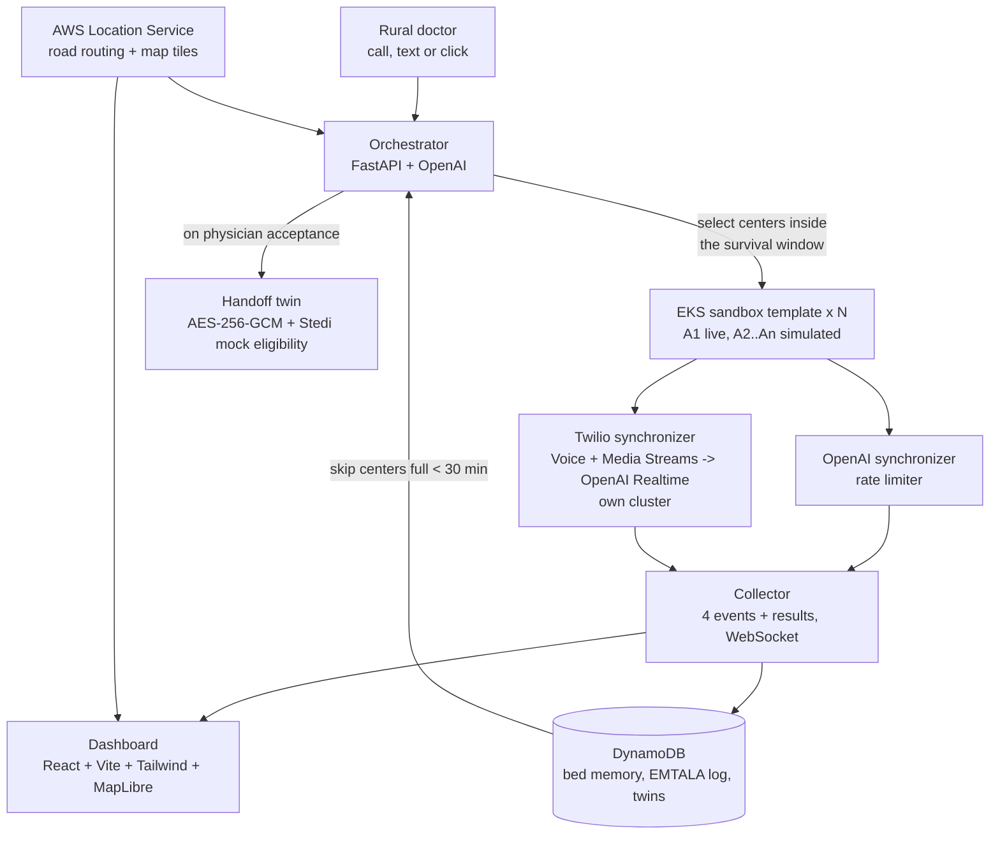
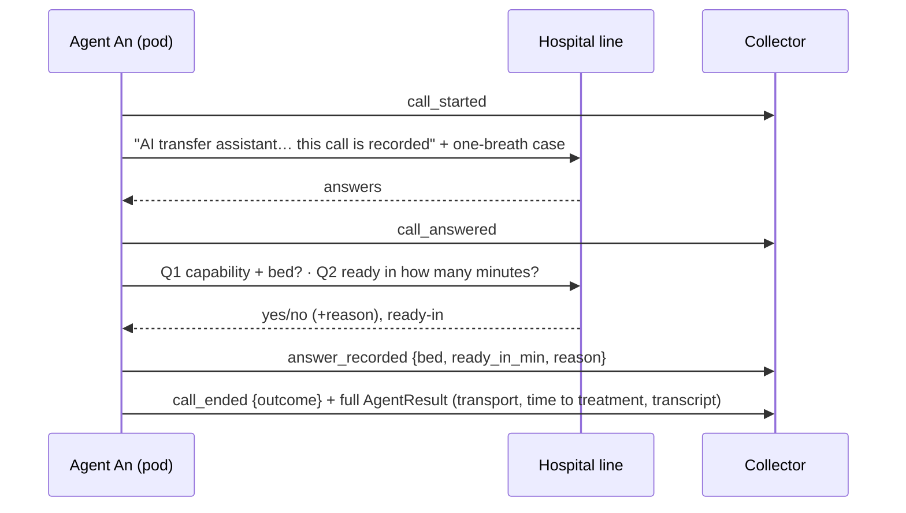

# Marco Polo

An AI agent swarm that finds an accepting ICU for a critical patient leaving a rural hospital — heart attack, stroke, or trauma — by calling every capable center inside the patient's survival window at the same time, then letting a physician confirm the best yes. In the game, one player calls "Marco" and everyone answers "Polo" at once.

- PRD v2: [docs/PRD.md](docs/PRD.md)
- Pitch deck (text and speaker notes): [docs/deck.md](docs/deck.md)
- Team plan (three lanes, contracts, checkpoints): [docs/team-plan.md](docs/team-plan.md)
- Demo region: Mississippi Delta — sending hospital South Sunflower County Hospital, Indianola; 15 verified receiving centers in MS, TN and AR.

## Layout

| Path | What it is |
| --- | --- |
| `data/hospitals.json` | Sending hospital, 15 verified centers with graded capability sources, survival windows, transport estimates, demo cases |
| `services/shared/schemas.py` | Case, agent header, the four call events, agent result, handoff twin |
| `services/orchestrator/` | Center selection inside the window, bed-memory skip, swarm launch, ranking, hold and release |
| `services/agent/` | Sandbox template: live call (A1) or simulated responder + transcript; emits the four events |
| `services/sync_openai/` | Rate limiter for model calls |
| `services/sync_twilio/` | Twilio Voice + Media Streams ↔ OpenAI Realtime, SMS, physician bridge (own cluster) |
| `services/collector/` | Receives events/results, streams to the dashboard, bed memory, EMTALA log |
| `services/handoff/` | Patient handoff twin: HL7 IPS bundle delivered as a SMART Health Link (JWE A256GCM, passcode, 24 h expiry), with a Stedi mock insurance check |
| `apps/dashboard/` | React + Vite + Tailwind + MapLibre live map |
| `infra/` | Kubernetes Job template, App Runner fallback, DynamoDB table |
| `scripts/run_local_swarm.py` | Whole swarm in one process, no network: `python3 scripts/run_local_swarm.py cardiac_icu` |
| `scripts/replay_fixture.py` + `data/fixtures/` | Replay sample events into the collector so the dashboard moves without a live call |
| `docs/` | PRD, pitch deck text, team plan, verified numbers with grades, competitors, demo script |

## Run it

Everything runs locally with **no keys**: every integration has a mock, and adding its key to `.env` switches it on.

```bash
make install          # Python venv + dashboard packages
make test             # 7 tests, including the whole flow end to end in one process
make dev              # all services + dashboard; open http://localhost:5173 and press "Find a bed"
make smoke            # (with make dev running) start a transfer, wait for answers, accept, print the twin link
```

| Service | Port | Without keys | Switches to live when `.env` has |
| --- | --- | --- | --- |
| Orchestrator | 8000 | Swarm runs in-process | `LAUNCH_MODE=k8s` (one Job per hospital); `USE_AWS=1` + `AWS_LOCATION_ROUTE_CALCULATOR` for road times |
| OpenAI gateway | 8001 | Template transcripts | `OPENAI_API_KEY`, `OPENAI_MODEL` |
| Twilio gateway | 8002 | Logs calls/SMS to `/outbox` | `TWILIO_ACCOUNT_SID`, `TWILIO_AUTH_TOKEN`, `TWILIO_FROM_NUMBER`, `PUBLIC_HOST` (ngrok), `DEMO_*_PHONE` |
| Collector | 8003 | In memory | `USE_AWS=1` + `DYNAMODB_TABLE` |
| Handoff twin | 8004 | Offline insurance mock | `STEDI_TEST_API_KEY` + `STEDI_MOCK_*` (Stedi's documented mock member) |
| Dashboard | 5173 | MapLibre demo tiles | `VITE_MAP_STYLE` (AWS Location map style URL) |

`GET localhost:8000/health` shows which integrations are live. `SIM_A1_ANSWER=available` makes A1 say yes when there is no live call; `SIM_TIME_SCALE=0` makes simulated answers instant.

## Architecture

One agent template runs as N isolated pods on Amazon EKS; only the header (hospital, phone, location, capability question, transport tier) changes per pod. Every call path emits the same four events, so the voice provider can be swapped without touching the dashboard.



**One call, four events**



**Selection and ranking**

1. Keep only centers with the needed capability (cardiac ICU + cath lab · thrombectomy · Level I/II trauma, plus burn or pediatric center when needed).
2. Ground if it fits the transport budget; else air if it fits; else the faster mode inside the hard max. Beyond the hard max: not called unless a physician overrides.
3. Skip centers that said "full" in the last 30 minutes (bed memory).
4. Time to treatment = max(transport by recommended mode, ready-in) + 10 min handoff. Lowest wins; hold the best, release the rest on acceptance.

| Case | Transport budget | Hard max |
| --- | --- | --- |
| Heart attack (STEMI) | 75 min | 120 min |
| Stroke, large-vessel | 90 min | 240 min |
| Trauma (adult, burn, pediatric) | 60 min | 90 min |

**Deployment.** EKS for the swarm and services; the Twilio synchronizer in its own cluster; DynamoDB for memory, log and twins; AWS Location for routing and tiles; App Runner (or one EC2 box) and `scripts/run_local_swarm.py` as the no-Kubernetes fallback. Live voice Option A is Twilio Media Streams + OpenAI Realtime; Option B (fallback) is a Retell or Vapi agent on an OpenAI model. The handoff twin is an IPS-shaped FHIR bundle encrypted as a SMART Health Link; the eligibility check (X12 270/271) runs after acceptance and never gates the transfer (EMTALA 42 CFR 489.24(d)(4)).

## Team

Three equal lanes (~6 h of build each plus a third of the pitch) that merge without conflicts; details in [docs/team-plan.md](docs/team-plan.md).

| Lane | Main role | Owns |
| --- | --- | --- |
| Engine | Voice and agents: live call, simulated hospitals, SMS and physician bridge | `services/agent`, `services/sync_twilio`, `services/sync_openai` |
| Backbone | Orchestration and cloud: selection, ranking, hold and release, DynamoDB, AWS Location, EKS | `services/orchestrator`, `services/collector`, `infra`, `data` |
| Face | Experience and handoff: dashboard, handoff twin (IPS + SMART Health Link + insurance), deck | `apps/dashboard`, `services/handoff`, `docs/deck.md` |

Shared contracts live in `services/shared/schemas.py` and the service endpoints listed in the team plan; changing them needs a PR all three approve.

## Rules
- A1 is a real call to a teammate's phone. Every other agent runs the same code against a simulated responder.
- Never dial the real hospital numbers in `data/hospitals.json` (`phone_reference` is reference only).
- Fictional patients only; no severity scoring by the AI; a physician accepts every transfer.
