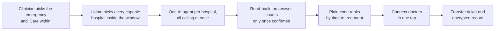
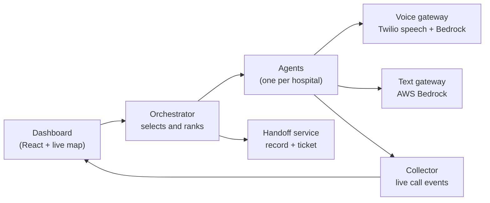

# Project Uzima

**The beds exist. We get people to them in time.**

Uzima (oo-ZEE-mah, Swahili for life) helps a clinician at a small hospital find a bigger hospital that can take a critically ill patient right now. One AI agent per capable hospital calls them all at the same time, reads every answer back until the hospital confirms it, and ranks the confirmed yeses by time to treatment. One tap connects the doctors, and the patient travels with an encrypted transfer record.

Hospitals don't install anything. They just answer the phone.

- **Live demo:** [project-uzima.vercel.app](https://project-uzima.vercel.app/)
- **The story behind it:** [docs/STORY.md](docs/STORY.md)

**Winner of the Second Prize and the People's Choice Award** at the Healthcare AI Hackathon, San Francisco, September 26, 2026.

> Hackathon prototype built in one day at that event. It uses fictional patients only and never dials real hospital numbers.

## How it works



1. **Ask.** The clinician chooses the emergency (heart attack, stroke, trauma, burn, pediatric trauma or high-risk childbirth) and how fast care is needed, then presses **Find a bed**.
2. **Race.** Uzima selects every hospital that has the needed capability and can be reached in time by ground or air, and starts one agent per hospital. Every agent says it's an AI in its first sentence, asks one question, and reads the answer back.
3. **Decide.** The live map shows each answer as it arrives. Plain rules, not the AI, rank confirmed yeses by time to treatment: the longer of travel time and team-ready time, plus handoff. The clinician chooses.
4. **Connect.** One tap calls the accepting doctor, reads a short summary, then dials the referring clinician into the same call.
5. **Hand off.** Uzima creates a transfer ticket and an encrypted patient record (HL7 FHIR International Patient Summary, delivered as a SMART Health Link that expires after 24 hours). On arrival, the receiving team scans the ticket's QR code and the record opens in the browser.

## Architecture



| Service | Port | What it does |
| --- | --- | --- |
| Orchestrator | 8000 | Selects hospitals inside the time window, starts the agents, ranks answers, runs Connect and the handoff |
| Text gateway | 8001 | OpenAI GPT OSS on AWS Bedrock: interprets spoken answers and writes simulated hospital conversations |
| Voice gateway | 8002 | Twilio calls, speech recognition and synthesis, signed callbacks, the doctor conference |
| Collector | 8003 | Receives call events and results and streams them to the dashboard over WebSocket; remembers recent "full" answers |
| Handoff | 8004 | Encrypted records, transfer tickets and the in-browser record viewer |
| Public gateway | 8005 locally, 8080 in the cloud | The only public entry point: dashboard API, signed voice callbacks and handoff links |
| Dashboard | 5173 | The clinician's map and transfer controls |

**Stack.** Python 3.11+ with FastAPI, Uvicorn, Pydantic and httpx for the services; React, Vite, Tailwind and MapLibre (CARTO tiles) for the dashboard; Twilio for phone calls; OpenAI GPT OSS on AWS Bedrock for language; Python `cryptography` (AES-256-GCM) for the record; Vercel and Google Cloud Run for hosting.

## Getting started

Requirements: Python 3.11+ and Node.js 18+.

```bash
make install             # Python virtual environment + dashboard packages
cp .env.example .env     # fresh checkout only; .env stays private and is never committed
make test                # automated tests, all offline
make dev                 # every service + the dashboard
```

Open http://localhost:5173 and press **Find a bed**. Everything runs without keys: each integration has a mock, and adding its keys to `.env` switches it on.

| Command | What it does |
| --- | --- |
| `make preflight` | Checks Bedrock and HTTPS setup; never dials |
| `make smoke` | Runs a simulated transfer end to end; refuses to dial live phones |
| `make swarm` | Runs a local agent swarm for a heart-attack case |

For an offline rehearsal, set `TWILIO_ENABLED=0` and `SIM_A1_ANSWER=available`. Set `USE_BEDROCK=0` for fixed template conversations instead of AWS. Restart `make dev` after changing `.env`.

### Live phone calls

1. Set AWS credentials, `USE_BEDROCK=1`, `AWS_REGION=us-west-2` and `BEDROCK_MODEL_ID=openai.gpt-oss-20b-1:0`.
2. Set the Twilio account SID, auth token and voice number. Add only consenting teammate numbers to `DEMO_HOSPITAL_PHONES`, `DEMO_SENDING_DOCTOR_PHONE` and `DEMO_ACCEPTING_DOCTOR_PHONE`.
3. Start an HTTPS tunnel to the public gateway on port 8005, for example `cloudflared tunnel --url http://localhost:8005 --no-autoupdate`.
4. Set `PUBLIC_HOST` to the tunnel's hostname (no scheme), `HANDOFF_PUBLIC_URL` to its HTTPS URL, and `SHL_VIEWER_URL` to that URL plus `/view`.
5. Set `VOICE_PROVIDER=bedrock_gather` and `TWILIO_ENABLED=1`, restart the services, and run `make preflight`.

A passing preflight doesn't prove phone audio works; rehearse with two people as described in [docs/INTEGRATION_PLAN.md](docs/INTEGRATION_PLAN.md).

## Deployment

The hosted demo runs the dashboard on Vercel and the backend on Google Cloud Run, with AWS Bedrock for the model and Twilio for calls. See [docs/VERCEL.md](docs/VERCEL.md) and [infra/gcp/README.md](infra/gcp/README.md). Templates for AWS (App Runner, DynamoDB) and Kubernetes (one Job per hospital agent) are in [`infra/`](infra/) but aren't active.

## Data

- [`data/hospitals.json`](data/hospitals.json): the sending hospital (South Sunflower County Hospital, Indianola, Mississippi) and 18 receiving hospitals in Mississippi, Tennessee and Arkansas. Every capability (cath lab, stroke clot removal, trauma level, burn, pediatric trauma, labor and delivery with a NICU) has a source link and a reliability grade.
- [`data/demo_patients.json`](data/demo_patients.json): one fictional patient per emergency type.
- The `phone_reference` numbers in the dataset are for reference only and are never dialed.

## Safety by design

- The agent discloses that it's an AI in its first sentence.
- An answer counts only after the hospital confirms the read-back; corrections restart the questions.
- Plain, explainable code ranks the answers, and a clinician confirms every transfer.
- Speech callbacks must carry a valid Twilio signature, and the public gateway exposes only the routes the demo needs.
- A failed live call is reported as a failure, never as a made-up answer. Results show whether they are live or simulated.

## Testing

`make test` runs the Python suite, all offline: selection, ranking, the end-to-end transfer, the voice conversation, read-back and corrections, callback signatures, the doctor conference, Connect retries, the encrypted record and ticket, and public-gateway restrictions. The dashboard relay has its own tests: `cd apps/dashboard && node --test tests/*.mjs`.

## Limitations

- Transfers, calls and tickets live in memory, so they reset when the service restarts; the hosted backend runs as a single instance.
- Travel times come from a distance-based estimate; AWS Location road routing and DynamoDB storage are built in but weren't enabled on the hackathon's AWS account.
- Other hospitals' answers are simulated, the insurance check is a mock, and Apple Wallet signing is off without a Pass Type ID certificate.
- The record format and clinical content haven't been certified for clinical use.

## Project structure

```
apps/dashboard/     React dashboard and its Vercel relay
services/           orchestrator, agent, collector, handoff, text and voice gateways, public gateway, shared code
data/               verified hospital data, fictional demo patients, test fixtures
infra/              Google Cloud, AWS and Kubernetes deployment files
scripts/            dev server, smoke test, preflight and swarm tools
tests/              automated tests
docs/               the story, deployment and integration notes
STATUS.md           the team's live task board
AGENTS.md           how changes are coordinated
```

## Team

Project Uzima was a group project, and every member played an important role in building it: Uditanshu Tomar, Sakshi Asati and Sukriti Sehgal. It won the Second Prize and the People's Choice Award at the Healthcare AI Hackathon in San Francisco.

## License

MIT. See [LICENSE](LICENSE).
