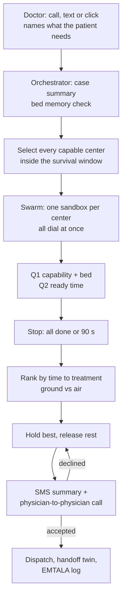
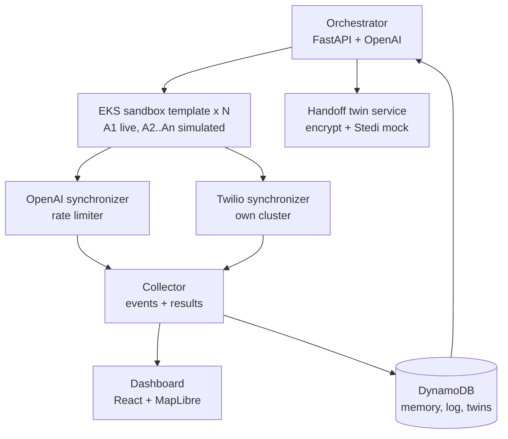

# Marco Polo — PRD v2

As of 2026-09-25 · Sukriti Sehgal

Second version of the plan: every ICU transfer, a Mississippi Delta demo, 2025–26 numbers only, one merged tech stack, and a moat built from bed memory plus a patient handoff twin. Supersedes PRD v1.

## Overview

Marco Polo is an AI agent swarm that finds an accepting ICU for a critical patient leaving a rural hospital — heart attack, stroke or trauma — by calling every capable center inside the patient's survival window at the same time, then letting a physician confirm the best yes. Every number below was checked at its source on 2026-09-25/26 and graded (A = government or peer-reviewed, B = state list, hospital site or industry report, C = news); anything that failed verification was dropped.

**Problem.** Rural hospitals can't treat their sickest patients and have no shared, live bed system, so when the usual hub is full, staff phone hospitals one at a time while the patient waits. In Sunflower County, Mississippi (28.9% poverty against 17.8% statewide, median household income $39,956), the nearest large hospital to Indianola — Greenwood, 27 miles away — had already shut its ICU before it laid off 86 staff and closed four services on April 8, 2026 ([Mississippi Free Press](https://www.mississippifreepress.org/struggling-greenwood-leflore-hospital-lays-off-86-employees-shuttering-four-more-services/)); it now runs as [UMMC Greenwood](https://umc.edu/greenwood) with a 24-hour ED. The next capable centers are 83–133 miles away in Jackson, Memphis and Little Rock.

**Evidence, 2025–26 only**

| Fact | Number | Source | Grade |
| --- | --- | --- | --- |
| Thrombectomy transfers that leave the first hospital within the AHA 90-minute goal (20,000+ patients) | 26% | [Lancet Neurology, Jan 2026](https://www.eurekalert.org/news-releases/1113022) | A |
| Chance of still receiving thrombectomy when that time runs 91 min to 3 h | 29% lower | same study | A |
| Hospitals meeting the AHA 30-minute door-in-door-out goal for heart-attack transfers | 10–14% | [JACC Case Reports, 2025](https://pmc.ncbi.nlm.nih.gov/articles/PMC12790212/) | A |
| Interfacility transfers arriving at US ERs by ambulance; growth in their share 2020–22 vs 2014–16 | 1.3M a year; +35% | [Am J Emerg Med, 2026](https://pubmed.ncbi.nlm.nih.gov/42054773/) | A |
| ER boarding at the January 2022 peak (46.2M hospitalizations, 2017–24) | 40.1% over 4 h; 6.3% over 24 h | [Health Affairs, 2025](https://www.healthaffairs.org/doi/abs/10.1377/hlthaff.2024.01513?journalCode=hlthaff) | A |
| Rural residents without a Level I/II trauma center within 60 minutes by ground (US overall: 23%) | 42% | [JAMA Network Open, Feb 2026](https://pmc.ncbi.nlm.nih.gov/articles/PMC12910394/) | A |
| Rural hospitals operating at a loss / vulnerable to closure | 41.2% / 417 | [Chartis, 2026](https://www.chartis.com/insights/2026-rural-health-state-state) | B |
| Rural hospitals closed or converted away from inpatient care since 2010 | 206 nationally, 12 in Mississippi | Chartis, 2026 | B |
| Mississippi rural hospitals vulnerable to closure | 24 (42%) | Chartis, 2026 | B |
| Rural hospitals at a loss in the 10 states that have not expanded Medicaid; Mississippi is one | 52.2% | Chartis, 2026; [KFF, Aug 2026](https://www.kff.org/affordable-care-act/state-indicator/state-activity-around-expanding-medicaid-under-the-affordable-care-act/) | B / A |
| Mississippi stroke deaths in 2024, the 2nd-highest rate in the US (52.1 per 100,000) | 1,925 | [MSDH](https://msdh.ms.gov/msdhsite/_static/23,30908,341.html) | A |
| Sunflower County poverty (ACS 2024 5-year) vs Mississippi (2024) | 28.9% vs 17.8% | [Census Reporter](https://censusreporter.org/profiles/05000US28133-sunflower-county-ms/); [USAFacts](https://usafacts.org/answers/what-is-the-us-poverty-rate/state/mississippi/) | A |

**Product in one line.** The rural doctor makes one call, text or click naming what the patient needs; one sandboxed agent per capable ICU inside the survival window calls all of them at once, asks two questions, recommends ground or air, and a physician confirms the best yes. After acceptance an encrypted handoff twin — the case, every call, every answer, transport plan, insurance status — travels with the patient.

**Why now.** Real-time voice AI and cloud agent sandboxes became production-ready in 2025–26; rural hospitals are closing or shedding inpatient care faster (Chartis 2026); ER boarding has become a year-round bottleneck (Health Affairs 2025); and states have started paying for transfer coordination (Indiana's 24/7 statewide coordination center under the Rural Health Transformation Program closed bids on June 15, 2026 — [in.gov](https://www.in.gov/grow-rural-health/initiatives/initiative-1)).

## Decisions since v1

The product is broader, the region is poorer and more rural, the stories are gone, and only verified 2025–26 numbers remain.

| Area | v1 | v2 | Why |
| --- | --- | --- | --- |
| Scope | Stroke transfers | Every critical transfer: heart attack, stroke, trauma (adult, burn, pediatric) | Bigger market; one agent template handles any specialty by swapping the capability question |
| Region | Alabama Black Belt | Mississippi Delta: Indianola → Jackson, Memphis, Little Rock | Poorer, more rural, three-state search across networks |
| Stories | COVID-surge cases | None; numbers only, plus the 2026 Greenwood hospital collapse | COVID-era cases invite "that was the pandemic" |
| Numbers | Mixed years | 2025–26 only, each opened at its source and graded | Judges and clinicians check |
| Distance | Ranking factor | Hard constraint: survival window per condition; ground vs air; centers outside the window are not called by default | Patient must arrive alive |
| Trauma matching | Level only | Level I/II plus the team needed: burn center, pediatric trauma center | Trauma is not one capability |
| Business | State coordination centers | Rural health networks and EMS agencies, monthly subscription | Direct buyers; state programs are market proof |
| Moat | Bed memory | Bed memory + the swarm + the encrypted handoff twin with insurance check | Data asset plus a record that travels with the patient |
| Results plumbing | Full result only | Four call events plus the full result | Any voice provider can plug in without dashboard changes |
| Simulated hospitals | Scripted, A1 always wins | Weighted random with realistic reasons | Honest demo; winner varies |
| Voice | Twilio + LiveKit + OpenAI Realtime | Twilio Media Streams + OpenAI Realtime; Retell or Vapi as the noon fallback | Fewer moving parts, plus a safety net |
| Maps, data, UI | Google routing, Redis, Next.js | AWS Location Service + MapLibre, DynamoDB, React + Vite + Tailwind | Sponsor fit and real road times |

## Users and goals

The primary user is the physician or transfer nurse at a rural sending hospital; the buyers are the rural health network that hospital belongs to and the regional EMS agency that moves the patient.

| User | Role | What they need |
| --- | --- | --- |
| Sending physician / nurse (rural hospital) | Starts the transfer, approves the final choice | One call, text or click; a confirmed bed and transport plan fast; works on weak internet |
| Receiving ICU transfer line | Answers the agent's call | A short complete case, two questions, no wasted holds |
| Accepting physician (receiving center) | Makes the medical yes | Case summary by text, physician-to-physician call, the handoff twin on arrival |
| EMS / air medical dispatcher | Moves the patient | Destination, ground-or-air recommendation, ready time |
| Rural health network or regional coordinator | Pays; watches the dashboard | Live map of who said yes, no or did not answer; the bed memory across their hospitals |

**Goals**

- Confirm an accepting ICU with the right capability, inside the patient's survival window, in under 2 minutes of wall-clock time.
- Call every capable center in the window at the same time, not one after another.
- Keep a physician in charge of every medical decision.
- Build a bed-availability memory from every call, and hand the receiving team an encrypted record of everything that happened.

**Non-goals**

- Diagnosing, scoring severity, or reading scans or ECGs (FDA territory).
- Replacing 911 or EMS dispatch.
- EHR integration in the hackathon build (SMART on FHIR sandbox is on the roadmap).

## Demo region: Mississippi Delta

The demo starts at South Sunflower County Hospital in Indianola and searches every verified capable center inside the patient's survival window across Mississippi, Tennessee and Arkansas. Every capability below was confirmed on the hospital's own site or a state designation list (grade B); two centers are kept only for the capabilities that could be confirmed.

**Why here.** Sunflower County: 24,333 people, 28.9% poverty, median household income $39,956 (ACS 2024). Mississippi has the 2nd-highest stroke death rate in the US, has lost inpatient care in 12 rural communities since 2010, has 24 rural hospitals (42%) vulnerable to closure, and has not expanded Medicaid. The nearest large hospital, Greenwood (27 miles), shut its ICU before its April 2026 layoffs and is now UMMC Greenwood with a 24-hour ED.

**Sending hospital.** [South Sunflower County Hospital](https://www.southsunflower.com/), 121 E Baker St, Indianola, MS: emergency department, inpatient care, obstetrics and surgery listed on its site; no ICU listed; Mississippi stroke Level 3 ([state list](https://www.mshealthcarealliance.org/systems-of-care/stroke/stroke-hospitals/)). Bed count could not be verified and is not claimed.

**Survival windows (drive the search radius)**

| Case | Transport budget | Hard max | Basis |
| --- | --- | --- | --- |
| Heart attack (STEMI) | 75 min | 120 min | AHA door-in-door-out ≤ 30 min ([JACC Case Reports 2025](https://pmc.ncbi.nlm.nih.gov/articles/PMC12790212/)); 120-min first-contact-to-device target, guideline citation still to attach |
| Stroke, large-vessel | 90 min | 240 min | AHA door-in-door-out ≤ 90 min ([Lancet Neurology 2026](https://www.eurekalert.org/news-releases/1113022)); 6-hour thrombectomy window, citation to attach |
| Trauma (adult, burn, pediatric) | 60 min | 90 min | 60-minute access standard ([JAMA Network Open 2026](https://pmc.ncbi.nlm.nih.gov/articles/PMC12910394/)) |

Transport estimates for the demo: road miles = straight line × 1.2, ground at 50 mph + 10 min loading, air = 35 min launch and loading + 130 mph. AWS Location road routing and real air-dispatch times replace these at build time.

**Receiving centers (nearest first)**

| Center | City | Miles | Ground / air | Cardiac ICU + cath lab | Thrombectomy | Trauma | Burn / pediatric |
| --- | --- | --- | --- | --- | --- | --- | --- |
| [Delta Health – The Medical Center](https://www.deltahealthsystem.org/services/cardiology/) | Greenville, MS | 22 | 42 / 45 | Yes; only STEMI receiving facility in the region, 24/7 | No (MS Level 3) | — | — |
| [UMMC](https://www.umc.edu/Healthcare/Stroke/Quality/comprehensive.html) | Jackson, MS | 83 | 129 / 73 | Yes; CV ICU, interventional cardiology | Yes; Joint Commission Comprehensive, MS Level 1 | [Level I, only in MS](https://umc.edu/som/Departments%20and%20Offices/SOM%20Departments/Surgery/Faculty-and-Divisions/trauma-critical-care/Overview.html) | Mississippi Burn Center; [Level 1 pediatric](https://umc.edu/Childrens/Childrens%20Emergency%20Medicine/Childrens-Emergency-Medicine.html) |
| St. Dominic Hospital | Jackson, MS | 83 | 129 / 73 | Not verified (site unreachable) — stroke case only | Yes; MS Level 1 | — | — |
| [Mississippi Baptist Medical Center](https://www.baptistonline.org/locations/jackson/services/baptist-heart) | Jackson, MS | 84 | 130 / 74 | Yes; ACC Chest Pain Center with Primary PCI | No (MS Level 2) | — | — |
| [Merit Health Central](https://www.merithealthcentral.com/our-services) | Jackson, MS | 84 | 131 / 74 | Yes; interventional cardiology + critical care (weakest source) | No (MS Level 3) | — | — |
| [Baptist Memorial – North Mississippi](https://www.baptistonline.org/locations/north-mississippi/services) | Oxford, MS | 89 | 138 / 76 | Yes; two cath labs, coronary ICU | No (MS Level 3) | — | — |
| [Methodist University Hospital](https://www.methodisthealth.org/locations/methodist-university-hospital) | Memphis, TN | 121 | 185 / 91 | Yes; Chest Pain Center with Primary PCI | Yes; Comprehensive | — | — |
| [Regional One Health](https://www.regionalonehealth.org/main-campus/regional-medical-center/elvis-presley-trauma-center/) | Memphis, TN | 122 | 185 / 91 | — | — | Level 1; only one within 150 mi | [Firefighters Burn Center](https://www.regionalonehealth.org/firefighters-burn-center/), ABA-verified, age 14+ |
| [Le Bonheur Children's](https://www.lebonheur.org/services/trauma-services) | Memphis, TN | 122 | 185 / 91 | — | — | — | ACS Level I pediatric trauma |
| [NMMC – Tupelo](https://www.nmhs.net/medical-services/emergency-and-trauma-care) | Tupelo, MS | 123 | 188 / 92 | Yes; MSDH STEMI receiving center | Yes; MS Level 1 | Level II | Secondary pediatric trauma |
| [Baptist Memorial – Memphis](https://www.baptistonline.org/services/stroke) | Memphis, TN | 124 | 188 / 92 | Yes; Heart Institute, CV ICU | Yes; Joint Commission Comprehensive | — | — |
| [Arkansas Children's](https://www.archildrens.org/programs-and-services/trauma-center) | Little Rock, AR | 129 | 196 / 95 | — | — | — | ACS Level 1 pediatric; [Arkansas' only burn program](https://www.archildrens.org/programs-and-services/burn-program), adults and children |
| [UAMS Medical Center](https://uamshealth.com/expertise/stroke-care/) | Little Rock, AR | 131 | 198 / 95 | Yes; cardiac ICU + cath lab | Yes; DNV Comprehensive, 24/7 clot removal | Level 1 | — |
| [CHI St. Vincent Infirmary](https://www.commonspirit.org/find-a-location/chi-st-vincent-infirmary-1390) | Little Rock, AR | 132 | 200 / 96 | Not verified | Not verified | Level II | — |
| [Baptist Health – Little Rock](https://www.baptist-health.org/location/baptist-health-medical-center-little-rock) | Little Rock, AR | 133 | 202 / 96 | Yes; interventional cardiology, heart transplant | Yes; Comprehensive (state + Joint Commission) | Level II | — |

**Who gets called, by case**

- Heart attack: 10 centers. Greenville by ground (42 min) is the only one inside the budget by road; Jackson (3) and Oxford by air inside the budget; Memphis, Tupelo and Little Rock by air inside the hard max.
- Stroke: 7 centers. Jackson (UMMC, St. Dominic) by air inside the budget; Memphis, Tupelo, Little Rock by air inside the hard max. No thrombectomy center is reachable by ground in time from Indianola.
- Trauma: UMMC by air (73 min). Under the estimate model Memphis lands at 91 min, one minute past the 90-min hard max, so real routing decides on the day and the physician can override. Burn: UMMC (Regional One is 14+ only). Pediatric: UMMC; Le Bonheur and Arkansas Children's sit outside the window.

**Excluded and why:** Saint Francis Memphis (thrombectomy certification could not be verified); Baptist Health North Little Rock (stroke-ready only); Greenwood/UMMC Greenwood (ICU closed; kept as context). Coordinates and phone numbers come from Google Maps via Apify; demo calls dial teammate phones only.

## User flow

One request fans out to every capable center inside the survival window, then narrows to one physician-accepted transfer with a transport plan.



If the accepting physician declines, the next-ranked yes (still held) is tried; every answer is written to bed memory.

**Selection rule (distance as a hard constraint)**

1. Keep only centers with the needed capability: cardiac ICU + cath lab; thrombectomy; Level I/II trauma, plus a burn center or pediatric trauma center when the injury needs one.
2. Ground if ground time fits the transport budget; else air if air fits; else the faster mode if it fits the hard max.
3. Centers beyond the hard max are not called by default. They appear greyed on the map and are called only on physician override.
4. Skip a center that said "full" within the last 30 minutes (bed memory), unless nothing else is left.

**The call script (every agent, same shape)**

1. Disclose: "This is an AI transfer assistant calling for South Sunflower County Hospital. This call is recorded."
2. Case in one breath: age, sex, condition, onset time, key score, ECG or imaging result, blood thinners.
3. Q1, by specialty: "Do you have a cardiac ICU bed and a cath lab team available right now?" / "a neuro ICU bed and a thrombectomy team" / "a trauma bay and surgical team" / "a burn ICU bed and burn team" / "a pediatric trauma bay and team". If no, ask the reason.
4. Q2: "When can you be ready to receive the patient?" (minutes). "Call back in five" is accepted and scheduled.
5. Close: "We'll call back within two minutes to confirm."

**Ranking.** Time to treatment = max(transport time by the recommended mode, ready-in minutes) + 10 minutes handoff. Lowest wins; ties go to the higher capability level. The top yes is held; the other yeses are released the moment a physician accepts; the twin is generated on acceptance.

## Moat

Three things compound with use: the bed memory, the swarm itself, and the handoff twin that leaves with every patient.

**1. Bed memory.** Hospitals won't enter bed data; they do answer the phone. Every answer (yes, no with reason, no answer, call back) is saved with a timestamp per center and capability. The next search skips centers known to be full, calls recent yeses first, and over time gives a rural network the live capacity picture nobody else has. More transfers, more accurate map.

**2. The swarm.** One agent template cloned into isolated sandboxes, one per hospital; the only thing that changes is the header (hospital, phone, location, capability question, transport tier). Ten calls or a hundred take the time of the slowest single call. Every call path emits the same four events, so the voice provider is swappable.

**3. Patient handoff twin.** After the accepting physician says yes, the system builds an encrypted record that travels with the patient and lands with the receiving team before the ambulance does:

| Section | Contents |
| --- | --- |
| Case | Age, sex, condition, onset time, key scores, ECG or imaging summary, blood thinners, weight |
| Search | Every center called, each answer, reason and time; who was held and released |
| Plan | Accepted center, accepting physician, ground or air, ETA, ready time |
| Insurance | Real-time eligibility result (270/271 via Stedi); the demo uses Stedi's free mock requests with a test key and fixed test member IDs, so no real payer or patient data is touched |
| Record | EMTALA log reference, timestamps |

Encrypted with AES-256-GCM, one key per transfer, delivered as a one-time link by SMS; the raw twin is never stored in the clear. In production it becomes a FHIR bundle so it can drop into the receiving EHR. It is a record of what happened during the transfer, not a clinical judgment: the AI never scores severity.

## Functional requirements

P0 must work live in the demo; P1 can be mocked; P2 goes on the roadmap slide.

| ID | Requirement | Priority |
| --- | --- | --- |
| FR-1 | Intake from the dashboard form: specialty (cardiac, stroke, trauma with burn/pediatric flags), onset time, key scores, ECG or imaging, blood thinners, weight; flags missing fields | P0 |
| FR-2 | Intake by SMS or phone call to the agent | P1 |
| FR-3 | Load the verified centers with capabilities, source grades, coordinates | P0 |
| FR-4 | Survival-window selection: compute ground and air time per center, assign tier and mode, exclude centers beyond the hard max unless a physician overrides | P0 |
| FR-5 | Skip centers marked full in bed memory within the last 30 min | P0 |
| FR-6 | Start one sandboxed agent per selected center; all dial within 1 second of each other | P0 |
| FR-7 | Each agent: disclosure, one-breath case, Q1 worded for the specialty, Q2 ready-in minutes, decline reason, "call back in 5" scheduling | P0 |
| FR-8 | A1 places a real Twilio call bridged to OpenAI Realtime (Option A); Retell or Vapi agent as the fallback (Option B) | P0 |
| FR-9 | A2–An use a weighted random simulated responder with realistic reasons and generated two-persona transcripts | P0 |
| FR-10 | Every call path emits call_started, call_answered, answer_recorded, call_ended, then a full result | P0 |
| FR-11 | Stop when all agents finish or after 90 seconds; unanswered = no answer | P0 |
| FR-12 | Rank yeses by time to treatment (transport by recommended mode vs ready-in, plus handoff) | P0 |
| FR-13 | Hold the top yes; release the other yeses by call or SMS on acceptance | P0 |
| FR-14 | SMS case summary to the accepting physician; bridge a physician-to-physician call | P0 |
| FR-15 | Build and encrypt the handoff twin (AES-256-GCM) on acceptance; show it on the dashboard | P0 |
| FR-16 | Deliver the twin as a one-time link by SMS | P1 |
| FR-17 | Insurance eligibility check in the twin via Stedi mock requests (test key, test member IDs) | P1 |
| FR-18 | Write every answer with a timestamp to bed memory (DynamoDB, 30-min TTL) | P0 |
| FR-19 | EMTALA log of every event and decision, exportable | P1 |
| FR-20 | Transcripts: live speaker-labeled lines for A1, persona text for the rest; Q1/Q2 answers extracted; saved with the log | P0 |
| FR-21 | Twilio call recording as a transcription backup | P1 |
| FR-22 | AWS Location road routing replaces the straight-line estimates; air time from dispatch assumptions | P1 |
| FR-23 | Dispatch confirmation SMS to the sender | P1 |
| FR-24 | Receiving-hospital AI agent that answers our agent (agent-to-agent) | P2 |
| FR-25 | Twin exported as a FHIR bundle via a SMART on FHIR sandbox | P2 |

## Architecture

One agent template runs as N isolated Kubernetes pods on Amazon EKS; only the header changes per pod, and every call path reports the same four events, so the dashboard never cares which voice provider answered.



| Component | Responsibility | Notes |
| --- | --- | --- |
| Orchestrator | Case summary, window-based selection, memory check, swarm launch, ranking, hold and release | `services/orchestrator` |
| Sandbox template | One call end to end from its header; live or simulated | `services/agent`, same image for every pod |
| Live voice (Option A) | Twilio Voice + Media Streams bridged over WebSockets to OpenAI Realtime; ngrok for local webhooks | `services/sync_twilio` |
| Live voice (Option B) | Retell or Vapi agent on an OpenAI model; transcript and answers by webhook | swap-in by 12:00 on the day if A is not clean |
| Simulated responder | Weighted random yes/no/no-answer/callback with specialty-specific reasons; two-persona transcript | `services/agent/app/responder.py` |
| OpenAI synchronizer | Queue and retry for model calls; several at once, never strictly one at a time | `services/sync_openai` |
| Collector | Receives the four events and full results, streams to the dashboard over WebSocket, writes bed memory and the EMTALA log | `services/collector` |
| Handoff twin | Builds the record, encrypts it, runs the Stedi mock eligibility check, hands out a one-time link | `services/handoff` |
| Maps and drive times | AWS Location Service route calculator and map tiles; MapLibre in the browser | replaces the estimate model |
| Data | DynamoDB: events (EMTALA log), bed memory with 30-min TTL, encrypted twins | `infra/aws/dynamodb-table.json` |
| Fallback runner | Whole swarm as parallel workers in one process; App Runner or one EC2 box | `scripts/run_local_swarm.py`, `infra/aws/apprunner.yaml` |

**Tech stack.** AWS (EKS, DynamoDB, Location Service, App Runner fallback) · OpenAI (orchestrator, personas, Realtime voice) · Twilio (voice, Media Streams, SMS) · Retell/Vapi (backup) · Stedi (eligibility, mock mode) · React + Vite + Tailwind + MapLibre · FastAPI.

**The four events** (`services/shared/schemas.py`): `call_started` → `call_answered` → `answer_recorded {bed, ready_in_min, reason}` → `call_ended {outcome}`, followed by a full `AgentResult` with transport estimate, time to treatment and transcript.

```json
{
  "agent_id": "A2", "hospital_id": "ummc", "specialty": "cardiac_icu",
  "capability_question": "Do you have a cardiac ICU bed and a cath lab team available right now?",
  "transport": {"est_ground_min": 129, "est_air_min": 73, "recommended_mode": "air", "tier": "within_target"},
  "live": false
}
```

## Demo scope

One call is real and the rest are simulated with the same agent code; the winner is not scripted, and we say so on stage.

| Part | Real or simulated | How |
| --- | --- | --- |
| Hospital names, capabilities, positions | Real, verified | State lists and hospital sites (grade B); Google Maps coordinates |
| Survival windows and transport tiers | Real rule, estimated times | Guideline-based windows; AWS Location road times when wired, otherwise the estimate model |
| Agent swarm on EKS | Real | Sandbox template cloned per header |
| A1 voice call, SMS, physician bridge | Real | Twilio + OpenAI Realtime to a teammate's phone; Retell/Vapi if needed |
| A2–An answers | Simulated, weighted random | ~12% no answer, ~8% "call back in 5", yes at 45% (large centers) or 30% (others), specialty-specific decline reasons |
| A2–An transcripts | Generated | Two OpenAI personas, short exchange |
| Bed memory | Real | Written from every answer; second case shows a skip |
| Handoff twin | Real encryption, fictional content | AES-256-GCM; shown decrypted on the dashboard |
| Insurance check | Mock | Stedi test key and fixed test member IDs (free, no real payer) |
| Accepting physician | Acted | A teammate on a second phone |
| Dispatch | Mocked | Button plus SMS confirmation |
| Patients | Fictional | Case 1: 62-year-old man, STEMI. Case 2: 68-year-old woman, large-vessel stroke |

The agent never calls a real hospital during the hackathon; every phone number in the run is a teammate's.

## Dashboard

A dark map in the middle, live call cards on the right, one recommendation at the bottom; it is the screen judges remember, so it gets the most polish.

| Area | Shows | Interaction |
| --- | --- | --- |
| Top bar | Case chip (62M, STEMI, onset 14:05) and two clocks side by side: Marco Polo elapsed, and "one by one: still on call 2 of 10" | None |
| Map (about 60%) | Indianola in the center; one line per agent to a real center; ground lines solid, air lines with a helicopter icon; centers outside the window greyed and dashed | Click a pin to open its card |
| Cards (about 40%) | Agent id, hospital, status in words, ready time, transport mode and minutes, tier, one line of live transcript; greens rise to the top | Click for the full transcript |
| Recommendation | Best center, time to treatment, mode; buttons Accept & release others, Choose another | Accept fires hold/release, SMS, physician bridge, twin |
| Twin panel | The decrypted handoff twin after acceptance, with the insurance line | Copy link (one-time) |
| Footer | Live tech counters (Realtime on call, GPT summaries, Location routes, DynamoDB events) and the label "Demo: hospital responses are simulated" | None |

**Status colors** (always paired with a word and an icon)

| Status | Color | Map line |
| --- | --- | --- |
| Calling | Yellow | Dashed, pulsing |
| Available | Green | Solid |
| Declined (reason shown) | Red | Solid |
| No answer, retrying / call back in 5 | Grey / pale yellow | Faded |
| Held / Accepted | Green | Thick, glowing |
| Released | Grey | Faded, labeled "released" |
| Outside window | Grey | Dashed, labeled "outside window" |

Rules: hospitals keep their real names; agents are A1–An; text at least 24 px on the projector; the simulated label never leaves the screen.

## Competitive landscape

Every existing product either serves the receiving hospital, works inside one network, or shows capacity without making the calls; nobody calls every capable center inside the survival window on behalf of the rural sender. Pages opened 2026-09-25/26.

| Company or program | What it does | Who buys | Gap for a rural sender |
| --- | --- | --- | --- |
| [Viz.ai](https://www.viz.ai/news/viz-ai-study-demonstrates-44-reduction-in-interfacility-stroke-transfer-times) (Viz Assist) | Stroke detection and transfer coordination inside hub-and-spoke networks; 2,000 US hospitals; 44% door-in-door-out cut (202 to 113 min) at one regional center, ISC 2026 | Stroke networks | Stroke only, one network |
| [TeleTracking Transfer IQ](https://www.teletracking.com/resources/transfer-iq/) | Transfer-center hub for receiving systems; "grow in-network referrals" | Receiving health systems | Built for the receiver |
| [ABOUT Healthcare](https://abouthealthcare.com/articles/hospital-transfer-center-software-essential-but-insufficient-2/) | Transfer-center software; hundreds of health systems use it to transfer patients into their hospitals | Receiving health systems | Built for the receiver |
| [Pulsara Transfer Ops](https://www.pulsara.com/transfer-operations) | Secure messaging that replaces phone calls between agencies and facilities | Hospitals, EMS, transfer centers | Does not search for beds or call other hospitals |
| [Juvare EMResource](https://www.globenewswire.com/news-release/2026/08/27/3352317/0/en/juvare-partners-with-healthcare-association-of-hawaii-to-power-statewide-healthcare-capacity-visibility.html) | Statewide bed-capacity dashboards (Hawaii, Aug 2026; refresh every 15 min) | States, hospital associations | Visibility only; nobody makes the calls |
| [VectorCare](https://www.vectorcare.com/feeds/blog/patient-management-software) | Transport and post-acute logistics | Hospitals, transport vendors | No bed search |
| [Indiana MOCC](https://www.in.gov/grow-rural-health/initiatives/initiative-1) | 24/7 statewide transfer-coordination hub under the Rural Health Transformation Program; trauma, stroke, psychiatric, maternal; bids closed June 15, 2026 | State | A staffed call center for one state; proof that transfer coordination is now funded |
| [Aurelian, Hyper](https://techcrunch.com/2025/08/27/911-centers-are-so-understaffed-theyre-turning-to-ai-to-answer-calls) | AI voice agents for 911 non-emergency calls; $14M Series A led by NEA, $6.3M seed | 911 centers | Inbound and non-emergency, not hospital-to-hospital |

**Where Marco Polo sits.** Rural sender first; every capable center across networks and state lines; distance as a hard constraint; the calls themselves build the bed memory; the twin follows the patient. A state coordination center is a customer, not a competitor: its staff still dial one hospital at a time.

## Safety and compliance

The agent speeds up calls and carries records; it never makes a clinical decision, and the one real regulatory trap, paying per referral, is avoided by flat pricing.

In June 2026 an AI bed system in Minas Gerais, Brazil (Core-MG) was blamed by a family after it downgraded a 32-year-old's severity score ("she would have been a 10, and the system only accepted her as a 6.8"); she waited five days for an ICU 186 miles away and died. The state disputes the claim ([Gizmodo, June 15, 2026](https://gizmodo.com/family-blames-ai-hospital-system-after-woman-dies-waiting-for-icu-bed-2000771949)). Marco Polo is designed as the opposite: it never scores severity.

| Area | Risk | Guardrail |
| --- | --- | --- |
| Clinical judgment | Low | No severity scoring, no diagnosis; a physician accepts every transfer; the survival windows come from guideline targets and the physician can override |
| Transport choice | Low | The agent recommends ground or air from time estimates; EMS and the physician decide |
| HIPAA | Low | Provider-to-provider sharing for treatment is permitted; the demo uses fictional patients; production needs business associate agreements with AWS, Twilio, OpenAI and Stedi (check each vendor's current terms) |
| Handoff twin | Medium | Minimum-necessary content; AES-256-GCM with a key per transfer; one-time link; never stored in the clear; audit trail of who opened it |
| Insurance data | Low | Eligibility checks are a permitted payment operation; the demo uses Stedi mock requests with test member IDs only |
| FDA | Low | Logistics and communication software, not a device; no scan or ECG interpretation |
| EMTALA | Medium | Physicians accept or decline, never the AI; every call and decision logged; decline reasons kept private to each hospital, only aggregates shared |
| Anti-Kickback | High if ignored | Flat monthly subscription; no per-referral or per-patient fees; ranking is clinically neutral and identical for paying and non-paying centers |
| AI calling and recording | Low | The agent says it is an AI and that the call is recorded at the start of every call; calls are business-to-business |

## Success metrics

The headline number is wall-clock time from Start to a held bed with a transport plan, measured live on stage.

| Metric | Demo target | Product target |
| --- | --- | --- |
| Start to held bed with transport plan | Under 2 min for 10 centers | Under 3 min, any number of centers |
| Agents dialing in parallel | 10 within 1 second | 30+ |
| Answered calls with both questions captured | 100% | 90%+ |
| Centers called outside the survival window without physician override | 0 | 0 |
| Wasted holds (a yes not released) | 0 | 0 |
| Handoff twin ready after acceptance | Under 5 seconds | Under 5 seconds |
| Clean end-to-end rehearsals | 3 of 3 | n/a |
| Transfers meeting the time goal | n/a | Above the 26% stroke baseline (Lancet Neurology 2026) and the 10–14% hospital STEMI baseline (JACC Case Reports 2025) |
| Bed-memory hit rate (search shortened by a recent answer) | Shown once in case 2 | Rising month over month |

## Build plan

One real call working end to end by 12:00 on the day is the only hard gate; everything else builds on it. Freeze rule: no new features after 15:30, only fixes.

**Done (this repo)**

- `data/hospitals.json`: verified centers, graded sources, survival windows, transport tiers, demo cases.
- Shared schemas, orchestrator selection and ranking, simulated responder, four-event emitter, collector with WebSocket stream and in-memory bed memory, handoff twin service with encryption and Stedi hook, dashboard skeleton, Kubernetes job template, App Runner fallback, DynamoDB table definition, local swarm runner, docs.

**Before the event**

| Task | Done when |
| --- | --- |
| Twilio: account, one number, teammates' phones verified (trial accounts only call verified numbers) | Test SMS and call land |
| OpenAI key with Realtime access; check rate limits | One Realtime session runs |
| Retell or Vapi agent on an OpenAI model | One test call to a teammate |
| AWS: EKS or App Runner, DynamoDB table, Location route calculator and map | `aws` calls succeed from the laptop |
| Stedi test key; one mock eligibility request | Mock 271 returns |
| ngrok for Twilio webhooks; clone Twilio's Media Streams + OpenAI Realtime sample | Sample answers a call |
| `npm install` in `apps/dashboard`; map tiles render | Empty map with Indianola centered |

**Hackathon day**

| Time | Engine | Face | Done when |
| --- | --- | --- | --- |
| 10:00–10:30 | Check in, Wi-Fi and hotspot | Same | Both laptops online |
| 10:30–12:00 | Live A1 call, Option A; not clean by 12:00 → Option B | Dashboard shell: map, empty cards, clocks | Teammate's phone rings, the AI asks both questions |
| 12:00–13:00 | Four events into the collector, DynamoDB writes | WebSocket feed; cards change on test events | A1's answer turns its card green |
| 13:00–14:30 | Simulated swarm on EKS (or App Runner) | Lines pulse and snap to green, red, grey | All 10 resolve on screen in one run |
| 14:30–15:30 | AWS Location routes, ranking, hold and release, twin + mock insurance | Recommendation card, Accept button, twin panel | Accept releases the others and shows the twin |
| 15:30–16:15 | Full runs, fix bugs, freeze | Screenshot into the deck; measured time on the time slide | Three clean runs in a row |
| 16:15–17:00 | Record the backup video; rehearse as the A1 hospital | Rehearse the pitch three times, under 3 minutes | Video saved locally, pitch timed |

## Risks and open questions

The biggest risk is the live call failing on stage; a recorded backup run covers it.

| Risk | Backup |
| --- | --- |
| Twilio + Realtime bridge not clean by 12:00 | Switch to Retell or Vapi on an OpenAI model |
| EKS setup eats the day | Same container on App Runner or one EC2 box; the local runner for the demo; say so on the architecture slide |
| Venue Wi-Fi or phone signal fails | Phone hotspot; play the backup video |
| Twilio trial blocks the call | Verify teammates' numbers the night before, or add credit |
| Rate limits during the demo | Only one real call; simulated agents stagger over 20–60 s |
| AI talks over the teammate | Rehearse; keep the teammate's lines short |
| Judge: "that's just concurrency" | Lead with the outcome, the survival window, bed memory and the twin |
| Judge: "that's Viz.ai" | Viz is stroke only and inside one network; we cover every ICU specialty across networks |
| Judge: "AI kills patients" (Brazil) | The Brazil system scored severity; ours never does; a physician accepts every transfer |
| Weakest data points questioned | Merit Health Central's cardiac source is the thinnest; St. Dominic cardiac and CHI St. Vincent cardiac/stroke are unverified and not used |

**Open questions**

- [ ] Attach guideline citations for the 120-minute STEMI first-contact-to-device target and the 6-hour thrombectomy window (the door-in-door-out targets are already sourced).
- [ ] Have a clinician confirm the transport budgets (75 / 90 / 60 min) and hard maxima (120 / 240 / 90 min).
- [ ] Trauma: keep the 90-minute hard max (Memphis lands at 91 under the estimate model) or widen it once AWS routing gives real times?
- [ ] Verify St. Dominic's cardiac capability through a reachable source so it can join the cardiac case.
- [ ] Pricing: [$__ per hospital per month] for rural networks and an EMS agency tier.
- [ ] Product name: "Marco Polo" is also a video-messaging app; fine for the hackathon, check before company use.
- [ ] Add a second, smaller sending hospital (a critical access hospital such as North Sunflower Medical Center, Ruleville) as a backup demo start point.
