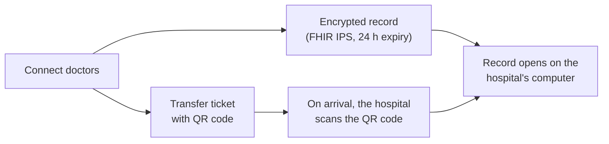

# The story of Project Uzima

**The beds exist. We get people to them in time.**

## Why

Only 26% of stroke patients who need a clot-removal transfer leave the first hospital within the recommended 90 minutes (Lancet Neurology, 2026). Only 10 to 14% of hospitals meet the 30-minute goal for transferring heart-attack patients (JACC Case Reports, 2025). Worldwide, of 8.6 million deaths a year from treatable conditions in low- and middle-income countries, about 5 million happen to people who had already reached the health system (The Lancet Global Health Commission, 2018).

Part of that delay happens before a transfer is even arranged. Picture the doctor or nurse at a small hospital with a patient they can't treat: a heart attack, a stroke, severe trauma, an obstetric emergency. There's no live, shared view of which beds and teams are free, so they pick up one phone and call bigger hospitals one at a time. Each call means waiting on hold, explaining the case again, and often hearing "we're full" or "call back," while the patient's window closes.

This matters for everyone involved. Patients lose treatable minutes to phone tag, not to distance. Clinicians spend their time on hold instead of with the patient. Receiving hospitals get rushed, incomplete handoffs. And the places that suffer most, rural and under-resourced hospitals, are exactly the ones with the fewest staff to spare for calling around.

## Why now

Voice AI can now hold a natural, real-time phone conversation, and cloud infrastructure can start one agent per hospital in seconds. That makes it possible to call every capable hospital at the same time, confirm each answer by reading it back, and connect the doctors.

Most importantly, it works over a plain phone call. Hospitals don't need a new app, login, internet connection or IT project, so it reaches the rural and under-resourced hospitals that can least afford one, anywhere a phone line works: from rural Nigeria to the Mississippi Delta.

## What we built

In one day, we built a working system that runs end to end:

1. **Ask.** The clinician picks the emergency and a "Care within" time, then presses Find a bed.
2. **Pick.** Uzima selects every hospital that can treat that emergency and be reached in time, from 18 real receiving hospitals in Mississippi, Tennessee and Arkansas whose capabilities we verified from public sources. The demo starts at South Sunflower County Hospital in rural Mississippi.
3. **Call.** One AI agent per hospital calls at the same time. Each says it's an AI, asks if they can take the patient and how soon, and reads the answer back. An answer counts only after the hospital confirms it.
4. **Decide.** The map updates live, and plain code, not AI, ranks the confirmed yeses by time to treatment. The clinician chooses.
5. **Connect.** One tap calls the accepting doctor, plays a short summary, then dials the sending doctor into the same call.
6. **Hand off.** Uzima creates a transfer ticket and an encrypted patient record carrying what US transfer rules (EMTALA) ask to travel with the patient: vital signs, treatment given, results, allergies, the doctor's certification and consent, and every call. On arrival, the hospital scans the ticket's QR code and the record opens on their computer.

## How it works

Six small Python (FastAPI) services and a React map dashboard. Live calls use Twilio's speech recognition and synthesis, with OpenAI's GPT OSS model on AWS Bedrock interpreting the answers; the same model writes the simulated hospitals' conversations. The dashboard is hosted on Vercel and the backend on Google Cloud Run. The technical details are in the [README](../README.md).

We tested it with automated tests covering selection, ranking, the voice conversation, Connect, and the encrypted record and ticket, all passing. In a live rehearsal with teammate phones, the agent got a yes with a 10-minute ready time, read it back, and Connect put three people on one call.

**What's real and what's simulated.** Real: hospital selection, the parallel agents, live calls with read-back, ranking, Connect, the record and the ticket. Simulated: the other hospitals' answers (labeled), the patient (fictional) and the insurance check. We never call real hospital numbers.

## Where it goes from here

**Who uses it and who pays.** The users are referring clinicians at small rural, critical-access and district hospitals, often a lone doctor or nurse on shift, who need one button rather than a new system. The buyers already own the transfer problem: health system transfer centers, regional stroke and heart networks and state EMS offices, and in low- and middle-income countries, ministries of health and NGOs that run referral networks. States are starting to fund this: Indiana took bids in June 2026 for a 24/7 statewide transfer coordination center. The model is a flat subscription per sending hospital, never per referral, so no one is paid to steer patients.

**Why it can spread.** Receiving hospitals need nothing: no software, integration or training. They answer the phone as they do today, so Uzima works even where there's no online bed registry, and it can adapt to local languages. Because each agent is independent, a quiet night and a mass-casualty surge work the same way: more calls means more agents in parallel, not a longer queue.

**What has to be true to scale.**
- HIPAA compliance, business associate agreements with every vendor, and only the minimum case details shared until a hospital accepts.
- EMTALA compliance, so no transfer is ever delayed or filtered by insurance.
- AI disclosure on every call, since the FCC treats AI voices as artificial under the TCPA, and consent where recording laws require it.
- A human fallback at every step, isolated agents, and an audit trail of every answer.

**Risks, and how we handle them.** Hospitals might distrust an AI caller, so it discloses itself up front and the clinician joins before anything is committed. The AI might mishear, so every answer is read back and counts only after confirmation. People might over-trust the recommendation, so plain, explainable code ranks the answers and a clinician confirms every transfer. Uzima coordinates logistics and never gives clinical advice; that scope would be confirmed with counsel and clinical partners before any clinical use.

## The team

Project Uzima was a group project built at the Healthcare AI Hackathon in San Francisco on September 26, 2026, and every member played an important role: Uditanshu Tomar, Sakshi Asati and Sukriti Sehgal.

## Sources

- Lancet Neurology, January 2026, on thrombectomy transfer times: https://www.eurekalert.org/news-releases/1113022
- JACC Case Reports, 2025, on heart-attack transfer times: https://pmc.ncbi.nlm.nih.gov/articles/PMC12790212/
- The Lancet Global Health Commission on High Quality Health Systems, September 2018: https://www.eurekalert.org/news-releases/877728
- Indiana Rural Health Transformation Program, transfer coordination center: https://www.in.gov/grow-rural-health/initiatives/initiative-1
- Hospital capability sources: [`data/hospitals.json`](../data/hospitals.json)
