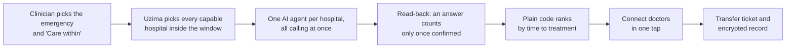
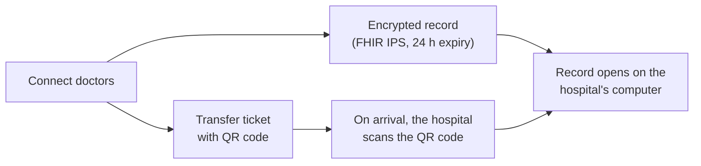
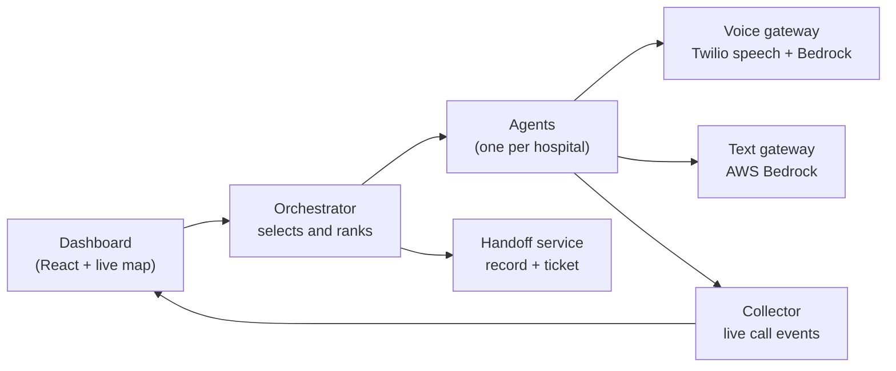

# Project Uzima: Hackathon Submission

26 Sept 2026 · @uditanshu tomar

Paste-ready answers for the required submission form. Bracketed items need a real number or link before we submit.

## 1. Team members' names

Uditanshu (Udit) Tomar, Sakshi Asati, Sukriti Sehgal

## 2. Project name

Project Uzima: an AI agent that calls every capable hospital at once to find an emergency bed, then connects the doctors in one tap. The beds exist. We get people to them in time.

## 3. What problem are you solving, and why does it matter?

We're starting with the doctor or nurse at a small hospital who has a critical patient they can't treat: a heart attack, a stroke, severe trauma, an obstetric emergency. They have to find a bigger hospital that can take the patient right now. There's no live, shared view of which beds and teams are free, so they pick up one phone and call hospitals one at a time. Each call means waiting on hold, explaining the case again, and often hearing "we're full" or "call back." Meanwhile the patient's window is closing: only 26% of stroke patients needing a clot-removal transfer leave the first hospital within the recommended 90 minutes (Lancet Neurology, 2026), and only 10 to 14% of hospitals meet the 30-minute goal for heart-attack transfers (JACC Case Reports, 2025).

Sequential calling adds coordination delay before a transfer can be arranged. Our prototype targets that step: asking multiple capable hospitals at once and turning their confirmed answers into a clear choice for the referring clinician. Its effect on clinical outcomes has not been measured yet.

This matters for everyone involved. Patients lose treatable minutes to phone tag, not to distance. Clinicians at small hospitals spend their time on hold instead of with the patient. Receiving hospitals get rushed, incomplete handoffs. And the places that suffer most, rural and under-resourced hospitals, are exactly the ones with the fewest staff to spare for calling around.

The timing is right because voice AI can now hold a natural, real-time phone conversation, and cloud infrastructure can start one agent per hospital in seconds. That makes it possible to call every capable hospital at the same time, confirm each answer by reading it back, and connect the doctors. Most importantly, it works over a plain phone call. Hospitals don't need a new app, login, internet connection or IT project, so it reaches the rural and under-resourced hospitals that can least afford one, anywhere a phone line works.

## 4. Describe what you built today

We built a working system that runs end to end. Here's what happens, in the order a user sees it.

1. **The clinician asks.** On one screen, the referring clinician picks the emergency (for example, heart attack) and how fast care is needed with a "Care within" slider, then presses Find a bed. That's the only thing they have to learn.
2. **Uzima picks the hospitals.** It finds every hospital that can treat that emergency and can be reached inside the window by road or air. In the demo, the sending hospital is South Sunflower County Hospital in rural Mississippi, and the network is 18 real receiving centers across Mississippi, Tennessee and Arkansas, with capabilities from public sources.
3. **One agent per hospital, all at once.** Uzima starts a separate AI agent for each hospital and they all call at the same time. Three real, verified team phones take part: the receiving hospital's reception desk, which the agent calls, the accepting doctor and the sending doctor. The other hospitals are simulated with realistic answers, identified as simulated in the recommendation.
4. **The call.** Each agent says it's an AI assistant in its first line, gives the case in one breath, asks if they can take the patient and how soon, then reads the answer back ("So that's yes, ready in 10 minutes. Is that right?"). An answer only counts after the person on the phone confirms it. The hospital just talks. No app, link or login.
5. **The live map.** As answers arrive, each hospital on the map turns green (yes, ready in N minutes), coral (no, with the reason) or grey (no answer). A clock shows Uzima's time next to how long calling one by one would take.
6. **The decision.** Plain code, not the AI, ranks the confirmed yeses by time to treatment: the longer of travel time and ready time, plus handoff. The top hospital is recommended with its reasons, and the clinician chooses the receiving hospital.
7. **Connect doctors.** The clinician presses one button. The separate accepting doctor is called and hears a short summary. After the summary, the sending doctor is dialed into the same conference. The hospital desk also joins if its original call is still open. Doctor to doctor, in one tap. Once the transfer ticket is created, the agent's calls are finished and the other hospitals are released.
8. **The record.** Uzima also builds the patient record in the international patient summary standard (HL7 FHIR IPS), encrypted as a SMART Health Link that expires after 24 hours, plus a mock insurance check. It carries what US transfer rules (EMTALA) ask to travel with the patient: vital signs, treatment given, test results, allergies, the doctor's certification and consent, and every call. It comes with a transfer ticket, like a boarding pass: the dashboard shows "Ticket created", and on arrival the receiving team scans the ticket's QR code, which opens the record on the hospital's computer. The handoff still works by voice alone.

**How it's built.** Six small Python (FastAPI) services, including a restricted public callback gateway, and a React map dashboard: an orchestrator that selects hospitals and ranks answers, a voice gateway that uses Twilio speech recognition and speech synthesis, with OpenAI GPT OSS on AWS Bedrock interpreting the hospital's responses, a collector that streams every call event live to the dashboard, and a handoff service for the encrypted record and transfer ticket. Simulated hospital conversations are generated live by OpenAI's GPT OSS model running on AWS Bedrock. Live and simulated agents share one event/result contract, so the dashboard and ranking use the same integration. Active calls and records currently use in-memory state. The same agent image can run as a Kubernetes Job per hospital, and we can store call events in Amazon DynamoDB and get road times from Amazon Location on AWS. Everything also runs in a mock mode with no keys, so anyone can try it.

**How we tested it.** 76 automated tests cover hospital selection inside the window, ranking, the accept flow, the voice gateway's answer handling and the Connect handoff, and they all pass. A fresh live rehearsal ran the hospital call from the beginning: the AI collected availability and a ten-minute ready time, read the answer back, and recorded it after confirmation. The result reached the dashboard. Connect then called the separate accepting doctor, played the summary and dialed the sending doctor. Twilio reported three unmuted participants in the same conference, including the hospital desk. Public ticket access, encrypted record decryption and actual Bedrock inference pass. The calls used teammate phones and fictional patient data; provider connection state does not independently establish audio quality.

**What's real and what's not.** Real: the time-window selection, one agent per hospital running in parallel, live phone calls with AI disclosure and read-back, the ranking, Connect on the live call, the encrypted record and the transfer ticket. Simulated or mocked: the other hospitals' answers (identified as simulated), the patient (fictional), and the insurance check (a sandbox). We never call real hospital numbers. Today the agents run as parallel tasks in one process; a Kubernetes Job launcher/template exists but is not running; AgentCore is a future option. DynamoDB and AWS Location are disabled because workshop permissions deny the required checks, so storage is in memory and road times are estimated.

## 5. What's the path to real-world impact?

**Who uses it and who pays.** The users are referring clinicians at small rural, critical-access and district hospitals: often a lone doctor or nurse on shift, sometimes with little training in transfer logistics. They need one button, not a new system. The buyers are the organizations that already own the transfer problem: health system transfer centers, regional stroke and heart networks, state EMS offices, and, in low- and middle-income countries, ministries of health and NGOs that run referral networks. We'd charge a flat subscription per sending hospital, never per referral, so no one is paid to steer patients.

**Why it can spread where it's needed most.** Receiving hospitals need nothing: no software, no integration, no training. They answer the phone like they do today. That removes the biggest barrier to adoption in under-resourced places, where IT projects stall. The same design adapts to local languages and to hospitals with no online bed registry, because the source of truth is the person who answers the phone. And because each agent is independent, the system handles a quiet night or a mass-casualty surge the same way: more calls means more agents in parallel, not a longer queue.

**What has to be true to scale.**

- Privacy and security: HIPAA compliance, a business associate agreement with each vendor, and sharing only the minimum case details until a hospital accepts.
- Transfer law: EMTALA in the US, so a transfer is never delayed or filtered by insurance status.
- Call rules: AI disclosure on every call (FCC treats AI voices as artificial under the TCPA), and consent before any recording where two-party consent applies.
- Reliability: a human fallback on every step, isolated agents so one failing call can't affect others, and an audit trail of every answer.
- Outside the US: local languages, local phone costs, and partners who already run referral networks.

**Risks and how we handle them.**

- Hospitals may not trust an AI caller. We disclose it up front, keep the questions short, and the clinician joins the call before anything is committed.
- The AI could mishear. Every answer is read back and confirmed, unclear answers are asked once more and then marked unclear, and nothing counts without a confirmation.
- People could over-trust the recommendation. The ranking is plain, explainable code, and a clinician confirms every transfer.
- Regulatory scope. Uzima coordinates logistics and never gives clinical advice; we'd confirm that scope with counsel and clinical partners before any clinical use.

## 6 to 8. Links and confirmation

- Demo link: [shareable link to the pitch deck or live demo page; open it in a private window to check]
- Code repository: https://github.com/sukritisehgal-28/project-uzima [must be public, or judges given access, before submitting]
- Demo video: [link, under 3 minutes, one clean run with live phones ringing]
- Confirmation: we confirm the project was built at this hackathon, and it uses only fictional patient data. The receiving hospitals are real public facilities, but their answers in the demo are simulated or come from team and judge phones; we never call real hospital numbers.
